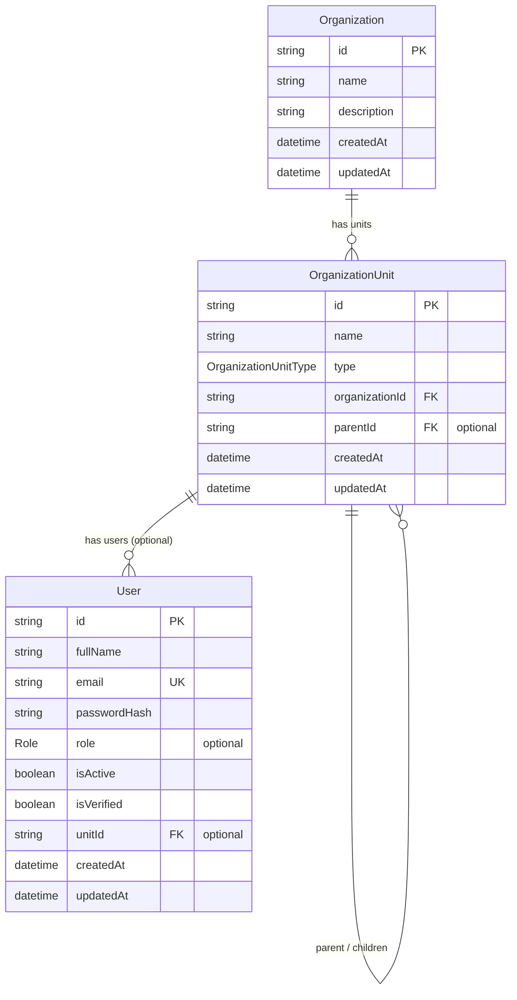

# RAG Database Schema

This document describes the PostgreSQL database structure for the Enterprise Retrieval-Augmented Generation (RAG) Platform, as defined in `backend/prisma/schema.prisma`.

---

# Overview

| Item | Value |
| ---- | ----- |
| Database | PostgreSQL |
| ORM | Prisma |
| Connection | `DATABASE_URL` (Neon) |
| Schema file | `backend/prisma/schema.prisma` |

The platform separates **authentication** from **organization management**. A user account can exist before belonging to any organization.

---

# Enums

## Role

User roles for Role-Based Access Control (RBAC).

| Value | Description |
| ----- | ----------- |
| `OWNER` | Organization creator and highest authority |
| `ADMIN` | Organization administrator |
| `MANAGER` | Department or team manager |
| `MEMBER` | Standard organization member |

**On `User`:** Optional (`Role?`) — no database default. A role is assigned only after a user creates or joins an organization. Newly registered users have `role = null` until provisioned.

---

## OrganizationUnitType

Classification of nodes in the organization hierarchy.

| Value | Description |
| ----- | ----------- |
| `COMPANY` | Root or top-level organizational entity |
| `DEPARTMENT` | Department within an organization |
| `TEAM` | Team within a department |
| `GROUP` | Smaller group or sub-team |

---

# Entity Relationship

```text
Organization
    │
    └── OrganizationUnit (tree: parent ↔ children)
            │
            └── User (optional — unitId may be null)
```



---

# Models

## Organization

Top-level tenant entity. Each organization owns a tree of units and, indirectly, all users assigned to those units.

| Field | Type | Constraints | Description |
| ----- | ---- | ----------- | ----------- |
| `id` | `String` | PK, `@default(cuid())` | Unique organization identifier |
| `name` | `String` | Required | Organization display name |
| `description` | `String?` | Optional | Short description |
| `createdAt` | `DateTime` | `@default(now())` | Record creation timestamp |
| `updatedAt` | `DateTime` | `@updatedAt` | Last update timestamp |

**Relations**

* `units` → one-to-many `OrganizationUnit`

**Cascade behavior**

* Deleting an organization cascades to all its `OrganizationUnit` records.

---

## OrganizationUnit

Hierarchical unit within an organization (company → department → team → group). Supports nested structure via self-referencing `parent` / `children`.

| Field | Type | Constraints | Description |
| ----- | ---- | ----------- | ----------- |
| `id` | `String` | PK, `@default(cuid())` | Unique unit identifier |
| `name` | `String` | Required | Unit display name |
| `type` | `OrganizationUnitType` | Required | Unit classification |
| `organizationId` | `String` | FK → `Organization.id` | Owning organization |
| `parentId` | `String?` | FK → `OrganizationUnit.id` | Parent unit (null = root) |
| `createdAt` | `DateTime` | `@default(now())` | Record creation timestamp |
| `updatedAt` | `DateTime` | `@updatedAt` | Last update timestamp |

**Relations**

* `organization` → many-to-one `Organization`
* `parent` / `children` → self-referencing hierarchy (`OrganizationHierarchy`)
* `users` → one-to-many `User`

**Indexes**

* `organizationId`
* `parentId`

**Cascade behavior**

* Deleting an organization cascades to its units.
* Deleting a parent unit cascades to child units.

---

## User

Application user account. Represents an authenticated identity and may exist independently of any organization until provisioned.

| Field | Type | Constraints | Description |
| ----- | ---- | ----------- | ----------- |
| `id` | `String` | PK, `@default(cuid())` | Unique user identifier |
| `fullName` | `String` | Required | User's full name |
| `email` | `String` | Unique | Login email |
| `passwordHash` | `String` | Required | Bcrypt (or similar) hashed password |
| `role` | `Role?` | Optional | RBAC role (assigned when user joins an organization) |
| `isActive` | `Boolean` | Default: `true` | Account enabled flag |
| `isVerified` | `Boolean` | Default: `false` | Email verification flag |
| `unitId` | `String?` | FK → `OrganizationUnit.id`, optional | Assigned organizational unit |
| `createdAt` | `DateTime` | `@default(now())` | Record creation timestamp |
| `updatedAt` | `DateTime` | `@updatedAt` | Last update timestamp |

**Relations**

* `unit` → optional many-to-one `OrganizationUnit`

**Indexes**

* `email`
* `unitId`

**Restrict behavior**

* A unit cannot be deleted while users are still assigned to it (`onDelete: Restrict`).

**Nullable fields**

| Field | Reason |
| ----- | ------ |
| `role` | Assigned when user creates or joins an organization |
| `unitId` | Assigned when user is linked to an organization unit |

---

# Hierarchy Example

```text
Organization: "Acme Corp"
│
├── OrganizationUnit (COMPANY)     "Acme Corp"
│   │
│   ├── OrganizationUnit (DEPARTMENT)   "Engineering"
│   │   │
│   │   └── OrganizationUnit (TEAM)     "Platform Team"
│   │           │
│   │           └── User (MEMBER)       alice@acme.com
│   │
│   └── OrganizationUnit (DEPARTMENT)   "Legal"
│           │
│           └── User (ADMIN)            bob@acme.com

User (no org yet)                     carol@example.com
(role = null, unitId = null)
```

---

# Referential Integrity Summary

| Relation | On Delete |
| -------- | --------- |
| `OrganizationUnit` → `Organization` | Cascade |
| `OrganizationUnit` → `OrganizationUnit` (parent) | Cascade |
| `User` → `OrganizationUnit` | Restrict (optional FK) |

---

# Schema Changelog

| Change | Before | After |
| ------ | ------ | ----- |
| `User.role` | `Role` with `@default(MEMBER)` | `Role?` (optional, no default) |
| `User.unitId` | Required `String` | Optional `String?` |
| `User.unit` | Required relation | Optional relation (`OrganizationUnit?`) |

---

# Authentication & Organization Workflow

Planned application behavior built on the current schema. Not all steps are implemented yet.

## User Lifecycle

```text
Register
    │
    ▼
User Created (role = null, unitId = null)
    │
    ▼
Login
    │
    ▼
Choose One
├── Create Organization
└── Join Organization (invitation — future phase)
    │
    ▼
Assign Organization Unit + Role
```

## Create Organization

```text
Authenticated User
        │
        ▼
Create Organization
        │
        ▼
Create Root Organization Unit
        │
        ▼
Assign Current User as OWNER
```

## Join Organization

Future phase.

```text
Owner/Admin
        │
Generate Invitation
        │
        ▼
Invited User Accepts
        │
        ▼
Assign Organization Unit + Role
```

Users never choose their own role or organizational unit. These are assigned by authorized organization administrators.

---

# Current Schema Status

| Component | Status |
| --------- | ------ |
| PostgreSQL datasource | ✅ Configured |
| Prisma Client generator | ✅ Configured |
| `Role` enum | ✅ Defined |
| `OrganizationUnitType` enum | ✅ Defined |
| `Organization` model | ✅ Defined |
| `OrganizationUnit` model | ✅ Defined |
| `User` model | ✅ Defined |

---

# Planned Extensions

Future phases may add:

* Invitation system
* Organization membership management
* Department and team management APIs
* Role and permission management
* Refresh tokens / sessions
* Document metadata and versioning
* Embeddings and vector references
* Audit logs
* Query cache entries

See `docs/DEVELOPMENT.md` for implementation progress.
