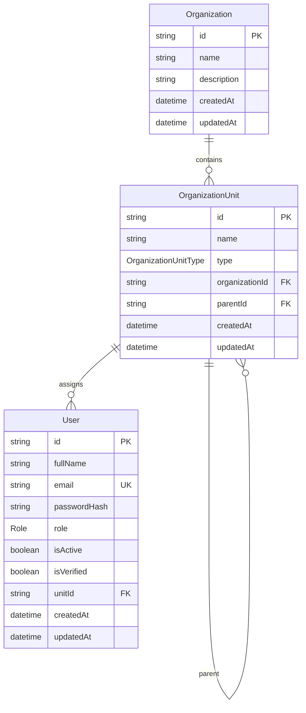

# RAG Database Schema

This document describes the PostgreSQL database schema for the Enterprise Retrieval-Augmented Generation (RAG) Platform, defined in `backend/prisma/schema.prisma`.

> **Status:** Reflects the current database schema. Planned features may not yet be implemented. See [`docs/DEVELOPMENT.md`](DEVELOPMENT.md) for implementation progress.

---

# Overview

| Item       | Value                          |
| ---------- | ------------------------------ |
| Database   | PostgreSQL                     |
| ORM        | Prisma                         |
| Connection | `DATABASE_URL` (Neon)          |
| Schema     | `backend/prisma/schema.prisma` |

## Current Scope

The schema currently provides the foundation for:

* User authentication
* Organizations
* Organization hierarchy
* Role-Based Access Control (RBAC)

Authentication is independent of organization membership. Users may register and authenticate before joining or creating an organization.

## Future Scope

Future phases will extend the schema with:

* Invitations
* Document management & versioning
* Embeddings & vector metadata
* Audit logs
* Query cache
* Retrieval analytics

---

# Enums

## Role

Organization-level roles used for RBAC.

| Value     | Description                  |
| --------- | ---------------------------- |
| `OWNER`   | Organization owner           |
| `ADMIN`   | Organization administrator   |
| `MANAGER` | Department or team manager   |
| `MEMBER`  | Standard organization member |

**Current behavior**

* `User.role` is optional.
* New users have no role until they join or create an organization.

---

## OrganizationUnitType

Defines the organization hierarchy.

| Value        | Description       |
| ------------ | ----------------- |
| `COMPANY`    | Root organization |
| `DEPARTMENT` | Department        |
| `TEAM`       | Team              |
| `GROUP`      | Sub-team or group |

---

# Entity Relationship

```text
Organization
        │
        └── OrganizationUnit
                │
        ┌───────┴────────┐
        │                │
    Parent/Child      Users (optional)
```



---

# Models

## Organization

Top-level tenant that owns an organization hierarchy.

### Fields

| Field         | Type       | Description            |
| ------------- | ---------- | ---------------------- |
| `id`          | `String`   | Primary key            |
| `name`        | `String`   | Organization name      |
| `description` | `String?`  | Optional description   |
| `createdAt`   | `DateTime` | Creation timestamp     |
| `updatedAt`   | `DateTime` | Last updated timestamp |

**Relations**

* One Organization → Many OrganizationUnits

**Delete Behavior**

* Cascade → OrganizationUnits

---

## OrganizationUnit

Hierarchical node supporting recursive parent-child relationships.

### Fields

| Field            | Type                   | Description            |
| ---------------- | ---------------------- | ---------------------- |
| `id`             | `String`               | Primary key            |
| `name`           | `String`               | Unit name              |
| `type`           | `OrganizationUnitType` | Unit type              |
| `organizationId` | `String`               | Parent organization    |
| `parentId`       | `String?`              | Parent unit            |
| `createdAt`      | `DateTime`             | Creation timestamp     |
| `updatedAt`      | `DateTime`             | Last updated timestamp |

**Relations**

* Belongs to Organization
* Parent / Child OrganizationUnit
* One-to-Many Users

**Indexes**

* `organizationId`
* `parentId`

**Delete Behavior**

* Cascade → Child units

---

## User

Authenticated application user. Organization membership is optional.

### Fields

| Field          | Type       | Description            |
| -------------- | ---------- | ---------------------- |
| `id`           | `String`   | Primary key            |
| `fullName`     | `String`   | Full name              |
| `email`        | `String`   | Unique email           |
| `passwordHash` | `String`   | Hashed password        |
| `role`         | `Role?`    | Organization role      |
| `isActive`     | `Boolean`  | Account status         |
| `isVerified`   | `Boolean`  | Email verification     |
| `unitId`       | `String?`  | Organization unit      |
| `createdAt`    | `DateTime` | Creation timestamp     |
| `updatedAt`    | `DateTime` | Last updated timestamp |

**Relations**

* Optional OrganizationUnit

**Indexes**

* `email`
* `unitId`

**Delete Behavior**

* Restrict → Assigned OrganizationUnit

**Nullable Fields**

| Field    | Reason                                 |
| -------- | -------------------------------------- |
| `role`   | Assigned after organization membership |
| `unitId` | Assigned after organization membership |

---

# Design & Workflow

## Authentication

Users register and authenticate independently of organization membership.

```text
Register
    │
    ▼
User Created
(role = null, unitId = null)
    │
    ▼
Login
```

---

## Organization Creation

After authentication, users may create an organization.

```text
Authenticated User
        │
        ▼
Create Organization
        │
        ▼
Create Root OrganizationUnit (COMPANY)
        │
        ▼
Assign OWNER Role
```

---

## Organization Membership (Planned)

```text
Owner/Admin
        │
Generate Invitation
        │
        ▼
User Accepts
        │
        ▼
Assign OrganizationUnit
        │
        ▼
Assign Role
```

Users never assign their own role or organization unit.

---

## Organization Hierarchy

Example:

```text
Company
│
├── Engineering
│   ├── Backend
│   └── Frontend
│
├── HR
│
└── Finance
```

---

# Referential Integrity

| Relationship                               | On Delete |
| ------------------------------------------ | --------- |
| OrganizationUnit → Organization            | Cascade   |
| OrganizationUnit → Parent OrganizationUnit | Cascade   |
| User → OrganizationUnit                    | Restrict  |

---

# Current Status

| Component                   | Status        |
| --------------------------- | ------------- |
| PostgreSQL datasource       | ✅ Implemented |
| Prisma schema               | ✅ Implemented |
| Prisma Client               | ✅ Generated   |
| `Role` enum                 | ✅ Implemented |
| `OrganizationUnitType` enum | ✅ Implemented |
| `Organization` model        | ✅ Implemented |
| `OrganizationUnit` model    | ✅ Implemented |
| `User` model                | ✅ Implemented |

---

# Planned Extensions

| Area                | Planned Features                                             |
| ------------------- | ------------------------------------------------------------ |
| Authentication      | Refresh tokens, session management                           |
| Organization        | Invitations, membership management, fine-grained permissions |
| Document Management | Documents, metadata, versioning, processing status           |
| AI & Retrieval      | Embeddings, vector references, retrieval history             |
| Monitoring          | Audit logs, query cache, evaluation metrics                  |

For implementation progress, see [`docs/DEVELOPMENT.md`](DEVELOPMENT.md).
