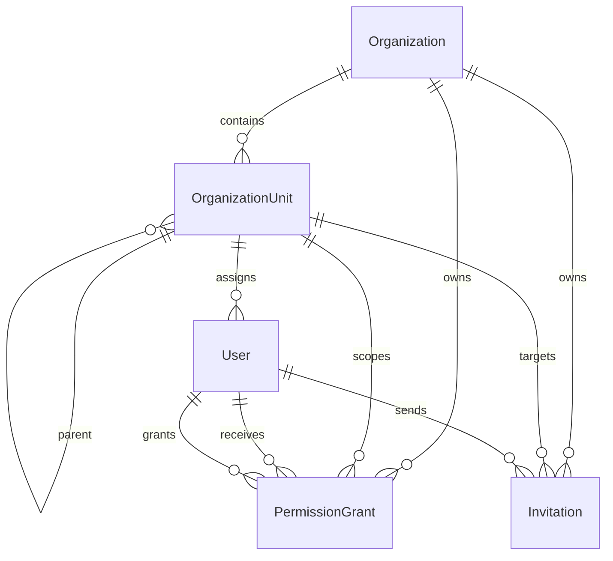

# RAG Database Schema

This document describes the PostgreSQL schema for the Enterprise Retrieval-Augmented Generation (RAG) Platform, defined in `backend/prisma/schema.prisma`.

> **Status:** Reflects the current database schema. Some schema foundations may exist before their backend services. See [`docs/DEVELOPMENT.md`](DEVELOPMENT.md) for implementation progress.

---

# Overview

| Item       | Value                          |
| ---------- | ------------------------------ |
| Database   | PostgreSQL                     |
| ORM        | Prisma                         |
| Connection | `DATABASE_URL` (Neon)          |
| Schema     | `backend/prisma/schema.prisma` |

The schema currently supports:

* User authentication
* Organizations and hierarchy
* Internal roles
* Hybrid permissions
* Hierarchy-scoped access
* Permission delegation and revocation
* Organization unit capacity
* Member invitations

Authentication is independent of organization membership. Users may register and authenticate before creating or joining an organization.

Future phases will add company-specific role display names, member management, documents and versioning, embeddings, vector metadata, audit logs, query caching, and retrieval analytics.

---

# Authorization Model

The platform uses a hybrid authorization model:

```text
Effective Access
=
Permission
AND
Hierarchy Scope
AND
Valid Delegation
```

The system separates:

```text
Role        → Internal organizational classification
Permission  → Action the user may perform
Scope       → Organization subtree where the action applies
Delegation  → Authority that granted the permission
```

Roles do not directly grant access. Each company decides who receives permissions, where they apply, and who may delegate them.

Example:

```text
User
├── Role: MANAGER
├── Unit: Backend
└── Permission Grant
      ├── Permission: INVITE_MEMBER
      ├── Scope: Backend
      ├── Granted By: Engineering Head
      └── Can Delegate: true
```

This permission applies to `Backend` and its descendants, but not parents, siblings, or other branches.

---

# Enums

## Role

| Value     | Description                |
| --------- | -------------------------- |
| `OWNER`   | Organization owner         |
| `ADMIN`   | Organization administrator |
| `MANAGER` | Management-level member    |
| `MEMBER`  | Standard member            |

`User.role` is optional until the user creates or joins an organization.

Roles are stable internal identifiers, not hard-coded permission rules. Companies may later customize only their display names:

```text
Internal Role    Example Display Name

OWNER            Founder
ADMIN            Director
MANAGER          Team Lead
MEMBER           Employee
```

The database still stores `OWNER`, `ADMIN`, `MANAGER`, and `MEMBER`. Actual access is controlled by permission grants.

## OrganizationUnitType

| Value        | Description            |
| ------------ | ---------------------- |
| `COMPANY`    | Root organization unit |
| `DEPARTMENT` | Department             |
| `TEAM`       | Team                   |
| `GROUP`      | Sub-team or group      |

Valid hierarchy:

```text
COMPANY → DEPARTMENT → TEAM → GROUP
```

Only these parent-child relationships are valid. Invalid relationships are rejected by the service layer.

## Permission

Platform-defined atomic permissions:

| Permission      | Purpose                     |
| --------------- | --------------------------- |
| `INVITE_MEMBER` | Invite a user               |
| `REMOVE_MEMBER` | Remove a member             |
| `UPDATE_MEMBER` | Update member information   |
| `ASSIGN_ROLE`   | Assign an internal role     |
| `MOVE_MEMBER`   | Move a member between units |
| `CREATE_UNIT`   | Create organization units   |
| `UPDATE_UNIT`   | Update organization units   |
| `DELETE_UNIT`   | Delete organization units   |

The platform defines available actions, while each company decides who receives them, where they apply, who may delegate them, and when they are revoked.

Future permissions may cover documents, retrieval, analytics, and administration.

## InvitationStatus

| Value      | Description            |
| ---------- | ---------------------- |
| `PENDING`  | Waiting for acceptance |
| `ACCEPTED` | Accepted               |
| `EXPIRED`  | No longer valid        |
| `REVOKED`  | Cancelled              |

---

# Entity Relationships

```text
Organization
├── OrganizationUnits
├── PermissionGrants
└── Invitations

OrganizationUnit
├── Parent / Children
├── Users
├── PermissionGrants
└── Invitations

User
├── Assigned Unit
├── Received PermissionGrants
├── Given PermissionGrants
└── Sent Invitations
```


```mermaid
erDiagram
    Organization ||--o{ OrganizationUnit : contains
    Organization ||--o{ PermissionGrant : owns
    Organization ||--o{ Invitation : owns

    OrganizationUnit ||--o{ OrganizationUnit : parent
    OrganizationUnit ||--o{ User : assigns
    OrganizationUnit ||--o{ PermissionGrant : scopes
    OrganizationUnit ||--o{ Invitation : targets

    User ||--o{ PermissionGrant : receives
    User ||--o{ PermissionGrant : grants
    User ||--o{ Invitation : sends
```

---

# Models

## Organization

Top-level tenant that owns the hierarchy, permission grants, and invitations.

| Field         | Type       | Description          |
| ------------- | ---------- | -------------------- |
| `id`          | `String`   | Primary key          |
| `name`        | `String`   | Organization name    |
| `description` | `String?`  | Optional description |
| `createdAt`   | `DateTime` | Creation timestamp   |
| `updatedAt`   | `DateTime` | Last update          |

Relations:

* Many OrganizationUnits
* Many PermissionGrants
* Many Invitations

Deleting an organization cascades to these records.

---

## OrganizationUnit

Represents a node in the organization hierarchy.

| Field               | Type                   | Description                       |
| ------------------- | ---------------------- | --------------------------------- |
| `id`                | `String`               | Primary key                       |
| `name`              | `String`               | Unit name                         |
| `type`              | `OrganizationUnitType` | Unit type                         |
| `organizationId`    | `String`               | Parent organization               |
| `parentId`          | `String?`              | Parent unit                       |
| `allocatedCapacity` | `Int?`                 | Capacity allocated to the subtree |
| `createdAt`         | `DateTime`             | Creation timestamp                |
| `updatedAt`         | `DateTime`             | Last update                       |

Relations:

* Organization
* Optional parent and many children
* Users
* PermissionGrants
* Invitations

Indexes:

* `organizationId`
* `parentId`

Deleting a unit cascades to children, scoped permission grants, and invitations. Units with assigned users are protected.

### Hierarchy and Scope

Example:

```text
Company
├── Engineering
│   ├── Backend
│   │   ├── API Group
│   │   └── Platform Group
│   └── Frontend
├── HR
└── Finance
```

A permission scoped to `Backend` applies to:

```text
Backend            ✅
API Group          ✅
Platform Group     ✅

Engineering        ❌
Frontend           ❌
HR                  ❌
Finance             ❌
```

The system keeps structure and delegation separate:

```text
OrganizationUnit.parentId     → Structural hierarchy
PermissionGrant.grantedById   → Delegation history
PermissionGrant.scopeUnitId   → Authorization boundary
```

---

# Tree Capacity

Capacity belongs to the organization tree, not to individual users or permission grants.

```text
Remaining Capacity
=
Allocated Capacity
− Direct Members
− Capacity Allocated to Direct Children
```

Example:

```text
Engineering Capacity = 100

├── Direct Members = 10
├── Backend Allocation = 40
├── Frontend Allocation = 30
└── Remaining Capacity = 20
```

Capacity flows downward:

```text
COMPANY: 1000
   ↓
DEPARTMENT: 300
   ↓
TEAM: 100
   ↓
GROUP: 30
```

A child cannot receive more than its parent's available capacity.

```text
Parent Capacity = 100

├── Child A = 40
├── Child B = 30
└── Parent Remaining = 30
```

All users with `INVITE_MEMBER` for the same unit share the same tree capacity.

```text
Backend Remaining = 5

Manager A → INVITE_MEMBER ✅
Manager B → INVITE_MEMBER ✅

Combined additional members allowed = 5
```

Only `allocatedCapacity` is stored. `remainingCapacity` is calculated.

---

## User

Authenticated application user with optional organization membership.

| Field          | Type       | Description         |
| -------------- | ---------- | ------------------- |
| `id`           | `String`   | Primary key         |
| `fullName`     | `String`   | Full name           |
| `email`        | `String`   | Unique email        |
| `passwordHash` | `String`   | Hashed password     |
| `role`         | `Role?`    | Internal role       |
| `isActive`     | `Boolean`  | Account status      |
| `isVerified`   | `Boolean`  | Verification status |
| `unitId`       | `String?`  | Assigned unit       |
| `createdAt`    | `DateTime` | Creation timestamp  |
| `updatedAt`    | `DateTime` | Last update         |

Relations:

* Optional OrganizationUnit
* Received PermissionGrants
* Given PermissionGrants
* Sent Invitations

Indexes:

* `email`
* `unitId`

`role` and `unitId` remain null until organization membership is created.

---

## PermissionGrant

Represents a permission delegated to a user within a specific hierarchy scope.

| Field            | Type         | Description             |
| ---------------- | ------------ | ----------------------- |
| `id`             | `String`     | Primary key             |
| `permission`     | `Permission` | Granted action          |
| `organizationId` | `String`     | Organization            |
| `userId`         | `String`     | Receiving user          |
| `scopeUnitId`    | `String`     | Allowed subtree         |
| `grantedById`    | `String`     | Granting user           |
| `canDelegate`    | `Boolean`    | May delegate permission |
| `isActive`       | `Boolean`    | Active status           |
| `revokedAt`      | `DateTime?`  | Revocation timestamp    |
| `createdAt`      | `DateTime`   | Creation timestamp      |
| `updatedAt`      | `DateTime`   | Last update             |

Indexes:

* `organizationId`
* `userId`
* `scopeUnitId`
* `grantedById`

Example:

```text
Permission:   INVITE_MEMBER
User:         Backend Manager
Scope:        Backend
Granted By:   Engineering Head
Can Delegate: true
Active:       true
```

The permission applies only to `Backend` and its descendants.

---

# Permission Delegation

A user may delegate a permission only when:

```text
1. The grant is active
2. The user owns the permission
3. canDelegate = true
4. The recipient is inside the allowed hierarchy
5. The new scope is inside the grantor's scope
```

Example:

```text
Engineering Head
└── INVITE_MEMBER
    ├── Scope: Engineering
    └── Can Delegate: true
```

The permission may be delegated to `Backend`, but not to `Finance`.

### Grant Replacement

Historical grants are never rewritten.

If an authority changes:

```text
1. Revoke the old grant
2. Preserve its history
3. Create a new grant from the new authority
```

`grantedById` is not replaced on an existing grant.

### Organization Parent Changes

A unit may move to a new parent after validating:

* Same organization
* Valid hierarchy relationship
* No circular hierarchy
* Required permission
* Capacity constraints

Changing `OrganizationUnit.parentId` does not rewrite permission delegation history.

---

## Invitation

Represents an invitation to join an organization.

| Field            | Type               | Description           |
| ---------------- | ------------------ | --------------------- |
| `id`             | `String`           | Primary key           |
| `email`          | `String`           | Invited email         |
| `organizationId` | `String`           | Target organization   |
| `unitId`         | `String`           | Target unit           |
| `role`           | `Role`             | Role after acceptance |
| `invitedById`    | `String`           | Inviting user         |
| `token`          | `String`           | Unique token          |
| `status`         | `InvitationStatus` | Lifecycle state       |
| `expiresAt`      | `DateTime`         | Expiration            |
| `createdAt`      | `DateTime`         | Creation timestamp    |
| `updatedAt`      | `DateTime`         | Last update           |

Indexes:

* `email`
* `organizationId`
* `unitId`
* `invitedById`
* `status`

Inviting and assigning roles are separate permissions:

```text
INVITE_MEMBER → Create invitation
ASSIGN_ROLE   → Select invitation role
```

Without `ASSIGN_ROLE`, the invitation uses the default internal role:

```text
MEMBER
```

Permissions are not stored on invitations:

```text
Invitation      → Organization membership
PermissionGrant → Actual access
```

---

# Workflows

## Authentication

```text
Register
   ↓
User Created
(role = null, unitId = null)
   ↓
Login
```

## Organization Creation

```text
Authenticated User
        ↓
Create Organization
        ↓
Create COMPANY Unit
        ↓
Assign OWNER Role
        ↓
Bootstrap Root Authority
```

## Invitation

```text
Authenticated User
        ↓
Check INVITE_MEMBER
        ↓
Validate Scope + Target Unit
        ↓
Role Selected?
   ├── No  → MEMBER
   └── Yes → Check ASSIGN_ROLE + Scope
        ↓
Create PENDING Invitation
        ↓
User Accepts
        ↓
Validate Token + Email + Expiry
        ↓
Validate Tree Capacity
        ↓
Assign Unit + Role
        ↓
Mark ACCEPTED
```

Users never assign their own unit, role, or permissions.

## Member Addition Rules

```text
1. Inviter has INVITE_MEMBER
2. Target unit is inside permission scope
3. Invitation is valid
4. Tree capacity is available
5. User accepts the invitation
6. Unit and role are assigned
7. Permissions are granted separately
```

## Authorization

```text
Authenticated User
        ↓
Load Required Permission
        ↓
Find Active Permission Grant
        ↓
Validate Organization
        ↓
Validate Hierarchy Scope
        ↓
Validate Target Resource
        ↓
ALLOW / DENY
```

For delegation:

```text
Has Permission?
        ↓
Can Delegate?
        ↓
Recipient Inside Scope?
        ↓
New Scope Inside Current Scope?
        ↓
Create Permission Grant
```

---

# Referential Integrity

| Relationship                     | On Delete |
| -------------------------------- | --------- |
| OrganizationUnit → Organization  | Cascade   |
| OrganizationUnit → Parent Unit   | Cascade   |
| User → OrganizationUnit          | Restrict  |
| PermissionGrant → Organization   | Cascade   |
| PermissionGrant → Receiving User | Cascade   |
| PermissionGrant → Scope Unit     | Cascade   |
| PermissionGrant → Granting User  | Restrict  |
| Invitation → Organization        | Cascade   |
| Invitation → OrganizationUnit    | Cascade   |
| Invitation → Inviting User       | Restrict  |

---

# Current Status

| Component                | Status        |
| ------------------------ | ------------- |
| PostgreSQL and Prisma    | ✅ Implemented |
| Prisma Client            | ✅ Generated   |
| Role and hierarchy enums | ✅ Implemented |
| Permission enum          | ✅ Implemented |
| Invitation status enum   | ✅ Implemented |
| Organization model       | ✅ Implemented |
| OrganizationUnit model   | ✅ Implemented |
| User model               | ✅ Implemented |
| PermissionGrant model    | ✅ Implemented |
| Tree capacity foundation | ✅ Implemented |
| Invitation model         | ✅ Implemented |
| Schema formatting        | ✅ Valid       |
| Schema validation        | ✅ Valid       |

---

# Planned Extensions

| Area           | Planned Features                            |
| -------------- | ------------------------------------------- |
| Authentication | Refresh tokens, sessions                    |
| Organization   | Company-specific role display names         |
| Permissions    | Checking, delegation, revocation            |
| Capacity       | Allocation and validation services          |
| Invitations    | Create, accept, expire, revoke              |
| Members        | Listing, role updates, movement, removal    |
| Documents      | Metadata, versioning, processing            |
| AI & Retrieval | Embeddings, vectors, retrieval history      |
| Monitoring     | Audit logs, query cache, evaluation metrics |

---

# Design Summary

The organization system uses four independent controls:

```text
Permission  → Who may act?
Scope       → Where may they act?
Delegation  → Who authorized them?
Capacity    → How much may the tree contain?
```

Final access model:

```text
Effective Access
=
Valid Permission
AND
Valid Hierarchy Scope
AND
Valid Delegation
AND
Applicable Capacity Constraints
```

This allows each company to define its own operational policy while preserving stable internal roles, hierarchy boundaries, delegated authority, capacity control, and auditable permission history.

For implementation progress, see [`docs/DEVELOPMENT.md`](DEVELOPMENT.md).
